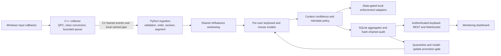

# Runtime architecture and privacy boundaries

The Windows collector is the only component that observes native input callbacks. It
converts a callback-local platform key identifier immediately to a broad key class and
only content-free C1 events cross the named-pipe boundary. Ordered events remain in a
bounded memory ring until the shared feature extractor emits C2 aggregates; raw streams
are never written to storage.



The dashboard and API are observers, not enforcement dependencies. A dashboard outage
cannot alter policy or action execution. Collector, pipe, model, storage, and watchdog
failures produce availability signals; enforcement remains fail-open, while bounded
replay/snapshots restore dashboard consistency after reconnect.

Persisted records are feature windows, scores, decisions, state/lifecycle metadata,
alerts, health/metrics, verification anchors, model metadata, candidate dispositions,
attacker-drill session declarations, and audit records. Typed content, raw key
identifiers, titles, document names, paths, URLs, clipboard data, and screen data are
prohibited at every boundary. Context affects only confidence with a configured nonzero
floor and never enters identity-model arrays.

## Attacker-drill data-flow boundary

A live attacker drill (ADR-014, `PLAN.md` §13.3) is declared per process with
`--drill-label` and recorded in the `drill_sessions` table, keyed by `session_id`.
Session grain is deliberate: a drill *is* a session — one person sits down, operates the
machine, and leaves. Recording it there rather than on `feature_windows` leaves the
protocol-generated `FeatureWindow`, the freeze digest, and every existing table
untouched, and gives every corpus loader one place to filter.

The flow is deliberately one-way. A drill window is **scored, context-assessed,
risk-fused, smoothed, escalated, enforced, alerted, audited, and streamed to the
dashboard** — suppressing any of that would mean the drill was not testing the live
system. What it may never do is become training data:

```
attacker window
  ├─→ score · risk · state transition · escalation · enforcement · alert · audit   ALLOWED
  ├─✗ load_window_summaries          (single centralized drill_sessions filter)
  │     └─✗ health · build_freeze · verify_freeze · load_frozen_corpus
  │           └─✗ require_enrollment_admission   (WINDOW_NOT_IN_FROZEN_CORPUS)
  │           └─✗ train_one_class_model · calibration · baseline construction
  │           └─✗ update candidate construction  (reads the frozen TRAIN partition only)
  ├─✗ update-candidate submission    (suppressed for drill sessions)
  ├─✗ automatic A1 login anchor      (the attacker did not authenticate)
  ├─✗ context-confidence learning    (suspended; assessment continues)
  └─✗ enrollment/calibration progress (suppressed; live risk state is NOT suppressed)
```

The last line is the distinction that matters most. *Enrollment and calibration
progress* — the bookkeeping that ages a user from `ENROLLING` to `CALIBRATING` to
`ACTIVE` — is suppressed, because attacker behaviour must not advance the legitimate
user's enrollment. *Live risk-state transitions*, including `DEGRADED`, and the entire
escalation ladder are **not** suppressed, because the drill exists to exercise them.

`tools/collection/repository.py::load_window_summaries` is the single centralized corpus
eligibility filter; `tools/collection/corpus.py::load_frozen_corpus` additionally
re-checks the manifest membership it verifies. Guardrail G12 fails the build if a corpus
loader stops filtering. The behavioural tests in `backend/tests/test_attack_drill.py` are
the real protection; G12 catches careless deletion.

All contracts originate in `protocol/`, all feature computations originate in
`ml/features/`, and all tunable thresholds, capacities, cadences, and quality limits
originate in `config/`. The default launcher records real `PILOT` data against a
separately reviewed storage and collection profile; provenance is derived solely from
the storage profile in use, with no other place to set it (spec Section 7.3). Runtime
tunables in the api, risk, context, orchestration, updates, and enforcement configs
remain unreviewed development placeholders regardless of which storage profile is
active.
