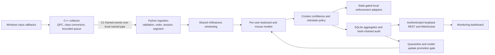

# Runtime architecture and privacy boundaries

The Windows collector is the only component that observes native input callbacks. It
converts a callback-local platform key identifier immediately to a broad key class and
only content-free C1 events cross the named-pipe boundary. Ordered events remain in a
bounded memory ring until the shared feature extractor emits C2 aggregates; raw streams
are never written to storage.

The dashboard and API are observers, not enforcement dependencies. A dashboard outage
cannot alter policy or action execution. Collector, pipe, model, storage, and watchdog
failures produce availability signals; enforcement remains fail-open, while bounded
replay/snapshots restore dashboard consistency after reconnect.

Persisted records are feature windows, scores, decisions, state/lifecycle metadata,
alerts, health/metrics, verification anchors, model metadata, candidate dispositions,
and audit records. Typed content, raw key identifiers, titles, document names, paths,
URLs, clipboard data, and screen data are prohibited at every boundary. Context affects
only confidence with a configured nonzero floor and never enters identity-model arrays.

All contracts originate in `protocol/`, all feature computations originate in
`ml/features/`, and all tunable thresholds, capacities, cadences, and quality limits
originate in `config/`. Development launchers accept synthetic provenance only; pilot
operation requires separately reviewed consent, storage, and collection configuration.
